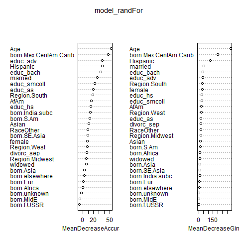
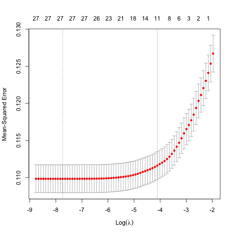
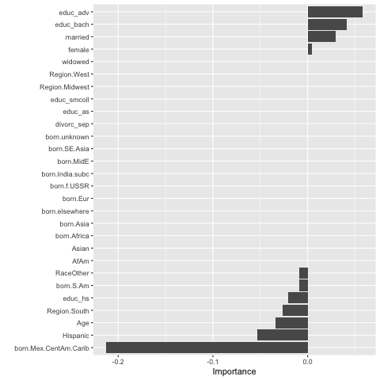
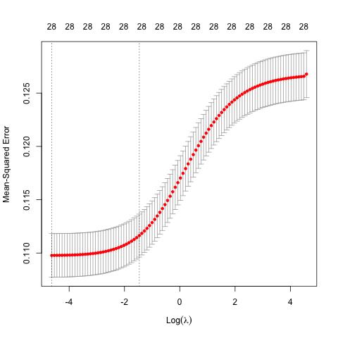
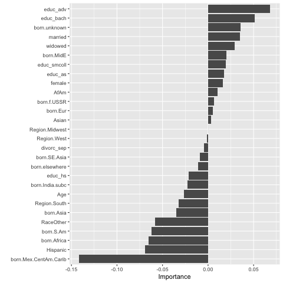
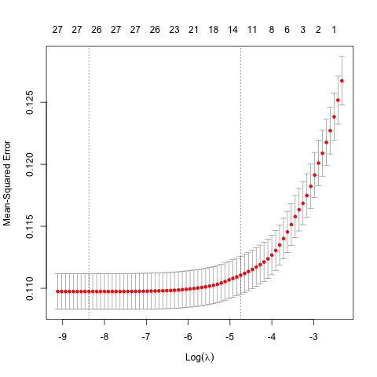
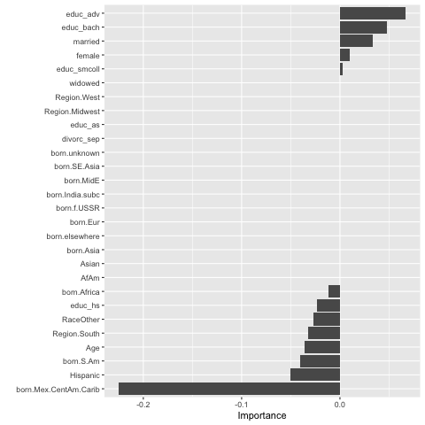

```{r Load NHIS, include=FALSE}
knitr::opts_chunk$set(echo = FALSE)
library(knitr)
load("NHIS_2014.RData")
```

```{r Recode Earn_LastYr}
data_use1$earn_lastyr <- as.factor(data_use1$ERNYR_P)
levels(data_use1$earn_lastyr) <- c("0","$01-$4999","$5000-$9999","$10000-$14999","$15000-$19999","$20000-$24999","$25000-$34999","$35000-$44999","$45000-$54999","$55000-$64999","$65000-$74999","$75000 and over",NA,NA,NA)
```
### Predicting Health Insurance Coverage
Using the provided data from the National Health Interview Survey 2014, we took a subset of respondents between the ages of 17 and 75. We chose this particular range with a view to further possible subgroups, such as examining the changes in insurance coverage from those of college age up to 26 and those in their late 20s and early 30s, who are [no longer eligible](https://www.healthcare.gov/young-adults/children-under-26/) to be claimed on their parents' plans.

Below we have subtotals and proportions for the respondents in the data set between the ages of 17 and 75 who have and do not have health insurance coverage. 
```{r Create Dat2 Props}
dat2 <- subset(data_use1, ((AGE_P >= 17) & (AGE_P <= 75)))
covprop <- dat2$NOTCOV 
covtable <- table(covprop)
agecovtable <- table(dat2$AGE_P, dat2$NOTCOV)
colnames(agecovtable) <- c("Covered", "Not Covered")
agetable <- addmargins(agecovtable)
names(covtable) <- c("Covered", "Not Covered")
t1 <- addmargins(covtable)
t2 <- prop.table(covtable)
kables(list(kable(t1, align = "l", col.names = c("Coverage", "Total")), kable(t2, col.names = c("Coverage", "Proportion"))))
```

Approximately `r round((prop.table(covtable)[1])*100, digits = 0)`% of respondents have health insurance coverage. 

Here are the logit regression results from the amended subset - Age $\ge 17$, $\le 75$.
```{r 1st Logit}
model_logit1 <- glm(NOTCOV ~ AGE_P + I(AGE_P^2) + female + AfAm + Asian + RaceOther  
                    + Hispanic + educ_hs + educ_smcoll + educ_as + educ_bach + educ_adv 
                    + married + widowed + divorc_sep + veteran_stat + REGION + region_born,
                    family = binomial, data = dat2)
summary(model_logit1)
```

Given that the dependent variable NOTCOV is coded 0 and 1. [(p. 202, Person Variable Layout Document) N.B. This link immediately initiates a PDF download](ftp://ftp.cdc.gov/pub/Health_Statistics/NCHS/Dataset_Documentation/NHIS/2014/personsx_layout.pdf). The value 1 meaning that the condition of no coverage *is* present, we can interpret from the logit regression that coefficients with a positive value are predictors of **NOT** having health insurance.

As we implement the other machine learning prediction models and interpret their results, we can keep the results of this logit regression in mind, as a guide for what the models are putting emphasis on and how they are treating the variables differently from model to model. For example, when we look at the results from the Support vector Machine, we know that in an SVM, the loss function for observations that fall on the correct side of the margins of the separating plane have no bearing on the position or slope of the separating plane. In a logit regression, the loss function is never exactly equal to zero, so observations that fall well within in each classification zone will still impact the position and slope of the separating plane as those observations change, even if the impact is very small. If the dependent classes are well separated, the logit regression is more susceptible to the impact of outlying determining variables than Support Vector Machines [(James, Witten, Hastie and Tibshirani, p. 357)](https://trevorhastie.github.io/ISLR/ISLR%20Seventh%20Printing.pdf).

```{r Factor Recode for data.frame}
d_region <- data.frame(model.matrix(~ dat2$REGION))
d_region_born <- data.frame(model.matrix(~ factor(dat2$region_born)))
dat_for_analysis_sub <- data.frame(
  dat2$NOTCOV,
  dat2$AGE_P,
  dat2$female,
  dat2$AfAm,
  dat2$Asian,
  dat2$RaceOther,
  dat2$Hispanic,
  dat2$educ_hs,
  dat2$educ_smcoll,
  dat2$educ_as,
  dat2$educ_bach,
  dat2$educ_adv,
  dat2$married,
  dat2$widowed,
  dat2$divorc_sep,
  d_region[,2:4],
  d_region_born[,2:12]) # need [] since model.matrix includes intercept term
names(dat_for_analysis_sub) <- c("NOTCOV",
                                 "Age",
                                 "female",
                                 "AfAm",
                                 "Asian",
                                 "RaceOther",
                                 "Hispanic",
                                 "educ_hs",
                                 "educ_smcoll",
                                 "educ_as",
                                 "educ_bach",
                                 "educ_adv",
                                 "married",
                                 "widowed",
                                 "divorc_sep",
                                 "Region.Midwest",
                                 "Region.South",
                                 "Region.West",
                                 "born.Mex.CentAm.Carib",
                                 "born.S.Am",
                                 "born.Eur",
                                 "born.f.USSR",
                                 "born.Africa",
                                 "born.MidE",
                                 "born.India.subc",
                                 "born.Asia",
                                 "born.SE.Asia",
                                 "born.elsewhere",
                                 "born.unknown")
```
We've utilized the provided data.frame and standarizing code to standardize the variables and create our training and test sets. The training set is comprised of 20% of the observations. We noticed that creating factors of REGION and region_born excluded Northeast and [Born in the US](https://www.youtube.com/watch?v=EPhWR4d3FJQ), which will influence the results the models produce. This may be an important factor for the researcher querying the dataset to consider.
```{r Standardize for Sobj, include=FALSE}
require("standardize")
set.seed(654321)
NN <- length(dat_for_analysis_sub$NOTCOV)
NN
restrict_1 <- as.logical(runif(NN) < 0.20) # use fraction as training data
# summary(restrict_1)
dat_train <- subset(dat_for_analysis_sub, restrict_1)
dat_test <- subset(dat_for_analysis_sub, !restrict_1)
sobj <- standardize(NOTCOV ~ Age + female + AfAm + Asian + RaceOther + Hispanic + 
                      educ_hs + educ_smcoll + educ_as + educ_bach + educ_adv + 
                      married + widowed + divorc_sep + 
                      Region.Midwest + Region.South + Region.West + 
                      born.Mex.CentAm.Carib + born.S.Am + born.Eur + born.f.USSR + 
                      born.Africa + born.MidE + born.India.subc + born.Asia + 
                      born.SE.Asia + born.elsewhere + born.unknown, dat_train, family = binomial)
s_dat_test <- predict(sobj, dat_test)
# summary(sobj$data)
```
#### OLS
```{r Linear Prob Model}
model_OLS1 <- lm(sobj$formula, data = sobj$data)
summary(model_OLS1)
pred_vals_OLS <- suppressWarnings(predict(model_OLS1, s_dat_test))
pred_model_OLS1 <- (pred_vals_OLS > 0.45)
pred1OLStable <- table(pred = pred_model_OLS1, true = dat_test$NOTCOV)
pred1OLStable
goodolspred <- sum((prop.table(pred1OLStable)[1,1])+(prop.table(pred1OLStable)[2,2]))
```
#### Logit
```{r Logit}
model_logit1 <- glm(sobj$formula, family = binomial, data = sobj$data)
summary(model_logit1)
pred_vals <- suppressWarnings(predict(model_logit1, s_dat_test, type = "response"))
pred_model_logit1 <- (pred_vals > 0.5)
pred1Logtable <- table(pred = pred_model_logit1, true = dat_test$NOTCOV)
pred1Logtable
goodlogpred <- sum((prop.table(pred1Logtable)[1,1])+(prop.table(pred1Logtable)[2,2]))
# round(goodolspred*100, digits = 2)
```
Given the standardized variables, we can compare the OLS and Logit regressions. While the values of each coefficient vary, the sign for each coefficient is the same across both regressions. The OLS regression is demonstrating the correlation of each variable with the condition of not having health insurance. The logit regression is giving us the probability of the condition of not having health insurance, given each variable.

Due to the standardization of the variables, the coefficients estimated by the OLS regression are all small - considering them as raw values gives us a skewed interpretation of the result; we need to consider where these the absolute values of the coefficients sit on the interval [0,1]. 

The logit regression is more straightforward, as we would expect the probabilities to be given on a [0,1] interval.

Changing the predvals parameter to > 0.45 increases the accuracy of both models, by 0.3% and 0.11% for the OLS and Logit models respectively. The increases are negligible. Leaving the Logit predvals value at > 0.5 makes more sense as 0.5 is a probability value in this model. Setting it to a value below 0.5 would skew the correct prediction rate of whether the dependent variable is equal to 1. The prediction rate of the OLS and Logit models are `r round(goodolspred*100, digits = 2)`% and `r round(goodlogpred*100, digits = 2)`% respectively.

### Random Forest Model
```{r Random Forest}
require('randomForest')
set.seed(54321)
model_randFor <- randomForest(as.factor(NOTCOV) ~ ., data = sobj$data, importance=TRUE, proximity=TRUE)
print(model_randFor)
round(importance(model_randFor),2)
varImpPlot(model_randFor)
# look at confusion matrix for this too
```

```{r RFPred}
pred_model1 <- predict(model_randFor,  s_dat_test)
RFpredtable <- table(pred = pred_model1, true = dat_test$NOTCOV)
RFpredtable
#print(sum(diag(RFpredtable))/sum(RFpredtable))
```
```{r Proportions of Correct Prediction}
RFproppred <- prop.table(RFpredtable)
# proppred
RFgoodpred <- sum((RFproppred[1,1])+(RFproppred[2,2]))
# goodpred
RFfalsepos <- RFproppred[2,1]
RFfalseneg <- RFproppred[1,2]
# falsepos
# falseneg
# round(goodpred*100, digits = 2)
```
Our Random Forest model gives us a correct prediction rate within the test data of `r round(RFgoodpred*100, digits = 2)`% and it provides us some clearer insight into the variables that are important to the accuracy of the model. We can see from both the Mean Accuracy Decrease and the Mean Gini Decrease that age, the education variables and the race variables are important to the accuracy of the model. Interestingly enough, region of birth is unimportant to the accuracy of this model - the two birth regions, Sth America and Mexico, Central America and the Caribbean with the highest importance link to the race variable with the highest importance, i.e. Hispanic. The Hispanic variable has a large impact on predicting that an observation *does not* have health coverage.

We can use the variable importance generated from the Random Forest to redesign our earlier OLS and Logit models and remove the less important variables.

Prior to that, we should tune our Random Forest model to determine the optimal number of variables used at each split of the data. We can also change the number of trees to make the model easier to compute.

Here is some code to tune the Random Forest for mtry (the number of variables used at each split). The number of trees in the forest has also been reduced to 100. 

```{r Optimal Variable Code for Random Forest, echo=TRUE}
mtry <- tuneRF(sobj$data[-1], as.factor(sobj$data$NOTCOV), ntreeTry = 100, stepFactor = 1.5, improve = 0.05, trace = TRUE, plot = TRUE)
```
```{r mtry}
mtry
best.m <- mtry[mtry[, 2] == min(mtry[, 2]), (1:2)]
print(best.m)
```

The optimal mtry number is 5, which in concert with a smaller number of trees reduced the Out of Box error rate from 13.77% to `r round((best.m[2])*100, digits = 2)`%. This rate tells us that as the model makes the splits and performs prediction tests on internally designated training and test data, it makes errors at a rate of `r round((best.m[2])*100, digits = 2)`%, performing slightly better than when the model is applied to the overall test data. 

### Support Vector Machines
```{r Support Vector Machines}
require(e1071)
# tuned_parameters <- tune.svm(as.factor(NOTCOV) ~ ., data = sobj$data, gamma = 10^(-3:0), cost = 10^(-2:1)) 
# summary(tuned_parameters)
# figure best parameters and input into next
svm.model <- svm(as.factor(NOTCOV) ~ ., data = sobj$data, cost = 10, gamma = 0.1)
svm.pred <- predict(svm.model, s_dat_test)
SVMpredtable <- table(pred = svm.pred, true = dat_test$NOTCOV)
SVMpredtable
SVMproppred <- prop.table(SVMpredtable)
SVMproppred
SVMgoodpred <- sum((SVMproppred[1,1])+(SVMproppred[2,2]))
SVMgoodpred
```
```{r include=FALSE}
svm.model2 <- svm(as.factor(NOTCOV) ~ ., data = sobj$data, cost = 10)
svm.pred2 <- predict(svm.model2, s_dat_test)
SVMpredtable2 <- table(pred = svm.pred2, true = dat_test$NOTCOV)
SVMpredtable2
SVMproppred2 <- prop.table(SVMpredtable2)
SVMproppred2
SVMgoodpred2 <- sum((SVMproppred2[1,1])+(SVMproppred2[2,2]))
```
```{r include=FALSE}
SVMproppred
SVMproppred2
SVMgoodpred
SVMgoodpred2
```
Running the SVM as given produces a correct prediction rate of `r round(SVMgoodpred*100, digits = 2)`%. We can change the SVM model by adjusted the cost and gamma parameters. The cost parameter determines the tolerance the model has to violations of the margins of the separating plane; the higher the cost, the narrower the margin, which produces results with high variance but a lower bias. With higher variance, the model may give [different estimates](https://machinelearningmastery.com/support-vector-machines-for-machine-learning/) for the function of the separating plane when applied to different data sets. If we want to lower the variance to keep estimates produced by the model similar as we change data sets, we need to increase the bias - we have to accept that the model makes more assumptions about the form of the separating function. To keep estimates more consistent across different data sets, we have to accept that the model will lose predictive power.

If we are comfortable with the data set at hand and seek strong predictive power, we can set our cost high, increasing the variance and lowering the bias of the model - similar to a logistic model. If we wish to look at multiple data-sets, to assess correlation and causality, the SVM model has to be adjusted with lower cost, reducing the variance and increasing the bias - similar to an OLS model.

Changing the gamma value in the model adjusts the flexibility of the separating plane. We removed the gamma value from the model and saw that while our False Positive prediction rate decreased by 7.25%, our False Negative rate increased by 0.09%. The trade off of these change in predictions depends on the context of the person asking the questions of the model. For a policy maker, correctly identifying those who lack healthcare coverage is important. Misallocating resources to provide health services to demographics that already have good access to those service is a waste of critical government infrastructure and revenues. For a health insurance company, the tolerance of misclassification may be higher. A person who was predicted to not have coverage can still be pitched with other health insurance products if they already have some sort of coverage.

### Regularized Regression Models (Elastic Net, Ridge, Lasso)
We have run one model for each of the regularized regression models: Elastic Net, Ridge, and Lasso. We did so to see and understand the difference between the three.

As the explanatory variables have been standardized, the coefficients are on a common scale. The penalty terms applied in these models will equally penalize all predictors, whether discrete or continuous. 

Removing explanatory variables that are not contributing to a model helps makes the models more interpretable. As the number of explanatory variables increase, the more likely we will tend to overfit our training data and underfit our testing data - we want to minimize this outcome. 

#### Elastic Net
Looking at the plot of our cross-validation ridge regression across all the lambda values (*plot(cvmodel1_elasticnet)*), we see a slight improvement in the MSE as our penalty, log(lambda), gets larger, which suggests that a regular OLS model likely [overfits the training data](https://bradleyboehmke.github.io/HOML/regularized-regression.html#fig:ridge-lasso-cv-viz-results). But if we continue to constrain the MSE further (i.e increase the penalty), our MSE starts to increase. In this plot we can see the optimal lambda  is -7.772985, as calculated from the function *log(cvmodel1_elasticnet$lambda.min)*. 

We chose to set alpha = 0.5, creating an equal combination of the Lasso and Ridge penalties.

Using the elastic net regression helps us identify which variables are most important to our model. We ran a Variable Importance Plot (*vip(cvmodel1_elasticnet, num_features = 50, geom = "col")*) on the cross-validation model of our elastic net regression. The advanced degree, bachelor's degree and being married variables all increase the probability of having health insurance. The high school education, residing in the South, being Hispanic or being born in Mexico/Central America/Caribbean decrease your probability of having health insurance. We note that the variables Hispanic and being born in Mexico/Central America/Caribbean are probably related and have multicollinearity. To account for this, the Elastic Net model uses the ridge penalty incorporated in it to ensure the variables are pushed towards each other.

Elastic net can also perform feature selection, utilizing the Lasso penalty; we can remove the variables that have coefficients pushed to zero, shown in the Variable Importance Plot below. Re-running the elastic net with these changes makes the model more accurate and easier to interpret.




```{r Elastic Net Regression, include = FALSE}
# Elastic Net
# install.packages("glmnet")
# install.packages("vip")
require(vip)
require(glmnet)
model1_elasticnet <-  glmnet(as.matrix(sobj$data[,-1]),sobj$data$NOTCOV, alpha = 0.5)

par(mar=c(4.5,4.5,1,4))
plot(model1_elasticnet)
vnat=coef(model1_elasticnet)
vnat=vnat[-1,ncol(vnat)] 
axis(4, at=vnat,line=-.5,label=names(sobj$data[,-1]),las=1,tick=FALSE, cex.axis=0.5) 

plot(model1_elasticnet, xvar = "lambda")
plot(model1_elasticnet, xvar = "dev", label = TRUE)
print(model1_elasticnet)

cvmodel1_elasticnet = cv.glmnet(data.matrix(sobj$data[,-1]),data.matrix(sobj$data$NOTCOV), alpha = 0.5) 
cvmodel1_elasticnet$lambda.min
log(cvmodel1_elasticnet$lambda.min)
coef(cvmodel1_elasticnet, s = "lambda.min")
cvmodel1_elasticnet
plot(cvmodel1_elasticnet)
cvmodel1_elasticnet$lambda.min
vip(cvmodel1_elasticnet, num_features = 50, geom = "col") 

pred1_elasnet <- predict(model1_elasticnet, newx = data.matrix(s_dat_test), s = cvmodel1_elasticnet$lambda.min)
pred_model1_elasnet <- (pred1_elasnet < mean(pred1_elasnet)) 

table(pred = pred_model1_elasnet, true = dat_test$NOTCOV)
ElasticNetpredtable <- table(pred = pred_model1_elasnet, true = dat_test$NOTCOV)
ElasticNetproppred <- prop.table(ElasticNetpredtable)
ElasticNetproppred
ElasticNetgoodpred <- sum((ElasticNetproppred[1,1])+(ElasticNetproppred[2,2]))
ElasticNetgoodpred

model2_elasticnet <-  glmnet(as.matrix(sobj$data[,-1]),sobj$data$NOTCOV, alpha = 0.5) 
model2_elasticnet
```

#### Ridge Regression
Looking at the plot of our cross-validation ridge regression across all the lambda values (*plot(cvmodel1_ridge)*), we see the optimal lambda is -4.62849, as calculated from the function. 
 
Ridge regression does not perform feature selection, so in the Variable Importance Plot, all variables show some degree importance. If we do not want to drop any of our variables for whatever reason, running a ridge regression will keep all available features in the final model.

After removing some of the variables we have identified as less important by the Lasso and Elastic Net Regressions, we re-run the Ridge Regression.





```{r Ridge Regression, include = FALSE}
# Ridge
# install.packages("glmnet")
# install.packages("vip")
require(vip)
require(glmnet)
model1_ridge <-  glmnet(as.matrix(sobj$data[,-1]),sobj$data$NOTCOV, alpha = 0)

par(mar=c(4.5,4.5,1,4))
plot(model1_ridge)
vnat=coef(model1_ridge)
vnat=vnat[-1,ncol(vnat)] 
axis(4, at=vnat,line=-.5,label=names(sobj$data[,-1]),las=1,tick=FALSE, cex.axis=0.5) 

plot(model1_ridge, xvar = "lambda")
plot(model1_ridge, xvar = "dev", label = TRUE)
print(model1_ridge)

cvmodel1_ridge = cv.glmnet(data.matrix(sobj$data[,-1]),data.matrix(sobj$data$NOTCOV), alpha = 0) 
cvmodel1_ridge$lambda.min
plot(cvmodel1_ridge)
log(cvmodel1_ridge$lambda.min)
coef(cvmodel1_ridge, s = "lambda.min")
vip(cvmodel1_ridge, num_features = 50, geom = "col")

pred1_ridge <- predict(model1_ridge, newx = data.matrix(s_dat_test), s = cvmodel1_ridge$lambda.min)
pred_model1_ridge <- (pred1_ridge < mean(pred1_ridge)) 

table(pred = pred_model1_ridge, true = dat_test$NOTCOV)
Ridgepredtable <- table(pred = pred_model1_ridge, true = dat_test$NOTCOV)
RidgeNetproppred <- prop.table(Ridgepredtable)
RidgeNetproppred
Ridgegoodpred <- sum((RidgeNetproppred[1,1])+(RidgeNetproppred[2,2]))
Ridgegoodpred

model2_ridge <-  glmnet(as.matrix(sobj$data[,-1]),sobj$data$NOTCOV, alpha = 0) 
model2_ridge
```
#### Lasso Regression
Looking at the plot of our cross-validation lasso regression across all the lambda values (*plot(cvmodel1_lasso)*), we see the optimal lambda is -8.187031. 

As the lasso regression performs an automated explanatory variable importance selection by using its lasso penalty to push variable coefficients to zero, we can look at the Variable Important Plot to identify which variables are less important. The Variable Important Plot function tells us that the "born-in" and "Region" variables, amongst others, are not important. The lasso regression marks the same variables as important as the elastic net and a few more; some college education and female are (both more likely for health insurance) & Race_Other, born Africa, born South America (all three less likely for having health insurance). Utilizing the ridge and lasso penalties, Elastic Net performs regularization and explanatory variable importance selection.




```{r Lasso Regression, include = FALSE}
# Lasso
# install.packages("glmnet")
# install.packages("vip")
require(vip)
require(glmnet)
model1_lasso <-  glmnet(as.matrix(sobj$data[,-1]),sobj$data$NOTCOV, alpha = 1)

par(mar=c(4.5,4.5,1,4))
plot(model1_lasso)
vnat=coef(model1_lasso)
vnat=vnat[-1,ncol(vnat)] 
axis(4, at=vnat,line=-.5,label=names(sobj$data[,-1]),las=1,tick=FALSE, cex.axis=0.5) 

plot(model1_lasso, xvar = "lambda")
plot(model1_lasso, xvar = "dev", label = TRUE)
print(model1_lasso)

cvmodel1_lasso = cv.glmnet(data.matrix(sobj$data[,-1]),data.matrix(sobj$data$NOTCOV),alpha = 1) 
cvmodel1_lasso$lambda.min
plot(cvmodel1_lasso)
log(cvmodel1_lasso$lambda.min)
coef(cvmodel1_lasso, s = "lambda.min")
vip(cvmodel1_lasso, num_features = 50, geom = "col")

pred1_lasso <- predict(model1_lasso, newx = data.matrix(s_dat_test), s = cvmodel1_lasso$lambda.min)
pred_model1_lasso <- (pred1_lasso < mean(pred1_lasso)) 

table(pred = pred_model1_lasso, true = dat_test$NOTCOV)
Lassopredtable <- table(pred = pred_model1_lasso, true = dat_test$NOTCOV)
LassoNetproppred <- prop.table(Lassopredtable)
LassoNetproppred
Lassogoodpred <- sum((LassoNetproppred[1,1])+(LassoNetproppred[2,2]))
Lassogoodpred

model2_lasso <-  glmnet(as.matrix(sobj$data[,-1]),sobj$data$NOTCOV, alpha = 1) 
model2_lasso
```

#### Regularization Regression: Results comparison
Overall, the correct prediction rates of the three models are very close. We had expected to see the largest difference between the ridge and lasso regressions - they differ by less than 0.0003%. The elastic net's prediction rate is between that of the ridge and lasso. Tweaking the elastic net alpha from 0.5 to 0.7, we see a slight change, bringing the correct prediction rate closer to the lasso rate. This is an intuitive change as alpha is getting closer to 1 (a lasso regression). 

False Positive rates are ~30%. Depending on the perspective of the researcher, this is a "good" problem to have as the model is predicting someone to not have health coverage when in fact they do. So at least when these people who think they do not have health insurance get into a car accident have to be rushed off to an emergency room will be pleasantly surprised to find out that they IN FACT HAVE health insurance to cover the expensive hospital visit they just had.

All three of the prediction rates are less than the 85.6% Random Forest good prediction rate and the 85.12 % Support Vector Machine good prediction rate. There is a difference of ~-22%. This maybe due to the fact that these Regularization regression methods are not ideal for a 0/1 dependent variable.

```{r Comparison}
table(pred = pred_model1_elasnet, true = dat_test$NOTCOV)
table(pred = pred_model1_ridge, true = dat_test$NOTCOV)
table(pred = pred_model1_lasso, true = dat_test$NOTCOV)


ElasticNetproppred
RidgeNetproppred
LassoNetproppred


ElasticNetgoodpred
Ridgegoodpred
Lassogoodpred
```
### Other Explanatory Variables
Based on the results from the previous Random Forest, SVM and Regularization models, we noticed that REGION and region_born were consistently unimportant to the models. Age, education, gender and marriage variables were all important, across all models. To test how these models would handle other variables, we removed REGION, region_born and the marriage variables. We created a factor from the person_healthstatus observations and included them in a new subset to test. We noticed that the factor excluded observations that had been coded "Excellent", which will influence how the models make the comparisons between the observations.
```{r HealthStat Varb}
healthstat <- data.frame(model.matrix(~ dat2$person_healthstatus))
dat_for_analysis2 <- data.frame(
  dat2$NOTCOV,
  dat2$AGE_P,
  dat2$female,
  dat2$AfAm,
  dat2$Asian,
  dat2$RaceOther,
  dat2$Hispanic,
  dat2$educ_hs,
  dat2$educ_smcoll,
  dat2$educ_as,
  dat2$educ_bach,
  dat2$educ_adv,
  healthstat[,2:5])
names(dat_for_analysis2) <- c("NOTCOV",
                                 "Age",
                                 "female",
                                 "AfAm",
                                 "Asian",
                                 "RaceOther",
                                 "Hispanic",
                                 "educ_hs",
                                 "educ_smcoll",
                                 "educ_as",
                                 "educ_bach",
                                 "educ_adv",
                                 "Very_Good",
                                 "Good",
                                 "Fair", "Poor")
```
```{r Train Set}
set.seed(654321)
NN2 <- length(dat_for_analysis2$NOTCOV)
NN2
restrict_2 <- as.logical(runif(NN2) < 0.20)
dat_train2 <- subset(dat_for_analysis2, restrict_2)
dat_test2 <- subset(dat_for_analysis2, !restrict_2)
sobj2 <- standardize(NOTCOV ~ Age + female + AfAm + Asian + RaceOther + Hispanic + 
                      educ_hs + educ_smcoll + educ_as + educ_bach + educ_adv + 
                      Very_Good + Good + Fair + Poor, dat_train2, family = binomial)
s_dat_test2 <- predict(sobj2, dat_test2)
```
#### OLS 2
```{r Linear Prob Model 2}
model_OLS2 <- lm(sobj2$formula, data = sobj2$data)
summary(model_OLS2)
pred_vals_OLS2 <- suppressWarnings(predict(model_OLS2, s_dat_test2))
pred_model_OLS2 <- (pred_vals_OLS2 > 0.45)
pred2OLStable <- table(pred = pred_model_OLS2, true = dat_test2$NOTCOV)
pred2OLStable
goodolspred2 <- sum((prop.table(pred2OLStable)[1,1])+(prop.table(pred2OLStable)[2,2]))
```
The estimates for Age, gender and education all have the same signs as they did in the initial OLS model. The health status coefficient estimates suggest that the variables of very good health and poor health correlate towards NOTCOV being zero. Intuition would suggest this is on the right track - those in very good health would have cheaper insurance premiums; those in poor health likely require health insurance to make sure all medical expenses can be covered.

#### Logit 2
```{r Logit 2}
model_logit2 <- glm(sobj2$formula, family = binomial, data = sobj2$data)
summary(model_logit2)
pred_vals2 <- suppressWarnings(predict(model_logit2, s_dat_test2, type = "response"))
pred_model_logit2 <- (pred_vals2 > 0.5)
pred2Logtable <- table(pred = pred_model_logit2, true = dat_test2$NOTCOV)
pred2Logtable
goodlogpred2 <- sum((prop.table(pred2Logtable)[1,1])+(prop.table(pred2Logtable)[2,2]))
# round(goodolspred*100, digits = 2)
```
The results of the Logit model align with those from the OLS model. We see a similar pattern of probability of not having health coverage. Those with more education have a lower probability of not having health insurance coverage. Those with very good health and those in poor health also have a lower probability of not having health insurance. The health status variables in the middle, Good and Fair health, while still low probabilities, tend towards not having health insurance.  

#### Random Forest Model 2
```{r Random Forest 2}
require('randomForest')
set.seed(54321)
model_randFor2 <- randomForest(as.factor(NOTCOV) ~ ., data = sobj2$data, importance=TRUE, proximity=TRUE)
print(model_randFor2)
round(importance(model_randFor2),2)
varImpPlot(model_randFor2)
```
Our second random forest model has a large increase in the false positive rate. It jumps from 83.06% to 94.68%. Again, the relevance of this increase depends on the context of the researcher. Pharmaceutical sales companies developing new drugs would be concerned with such an increase in false positives. Their sales and marketing teams would miss product placement opportunities amongst demographics that were falsely predicted to have low rates of health coverage.
```{r RFPred 2, include = FALSE}
pred_model2 <- predict(model_randFor2,  s_dat_test2)
RFpredtable2 <- table(pred = pred_model2, true = dat_test2$NOTCOV)
RFpredtable2
```

```{r Proportions of Correct Prediction 2, include = FALSE}
RFproppred2 <- prop.table(RFpredtable2)
# proppred
RFgoodpred2 <- sum((RFproppred2[1,1])+(RFproppred2[2,2]))
RFgoodpred2
RFfalsepos2 <- RFproppred2[2,1]
RFfalseneg2 <- RFproppred2[1,2]
```
#### SVM 2
```{r Support Vector Machines 2}
require(e1071)
# tuned_parameters <- tune.svm(as.factor(NOTCOV) ~ ., data = sobj$data, gamma = 10^(-3:0), cost = 10^(-2:1)) 
# summary(tuned_parameters)
# figure best parameters and input into next
svm2.model <- svm(as.factor(NOTCOV) ~ ., data = sobj2$data, cost = 10, gamma = 0.1)
svm2.pred <- predict(svm2.model, s_dat_test2)
SVM2predtable <- table(pred = svm2.pred, true = dat_test2$NOTCOV)
SVM2predtable
SVM2proppred <- prop.table(SVM2predtable)
SVM2proppred
SVM2goodpred <- sum((SVM2proppred[1,1])+(SVM2proppred[2,2]))
SVM2goodpred
# round(sum(SVMgoodpred-SVM2goodpred)*100, digits = 2)
# round(sum(RFgoodpred-RFgoodpred2)*100, digits = 2)
```
The second SVM model has a decrease in correct prediction rate of `r round(sum(SVMgoodpred-SVM2goodpred)*100, digits = 2)`%. This is a smaller change than the difference in correct prediction rates of the Random Forest models (`r round(sum(RFgoodpred-RFgoodpred2)*100, digits = 2)`%)


```{r Elastic Net 2 Regression, include = FALSE}
# Elastic Net
# install.packages("glmnet")
# install.packages("vip")
require(vip)
require(glmnet)
model1_elasticnet2 <-  glmnet(as.matrix(sobj2$data[,-1]),sobj2$data$NOTCOV, alpha = 0.5)

par(mar=c(4.5,4.5,1,4))
plot(model1_elasticnet2)
vnat=coef(model1_elasticnet2)
vnat=vnat[-1,ncol(vnat)] 
axis(4, at=vnat,line=-.5,label=names(sobj2$data[,-1]),las=1,tick=FALSE, cex.axis=0.5) 

plot(model1_elasticnet2, xvar = "lambda")
plot(model1_elasticnet2, xvar = "dev", label = TRUE)
print(model1_elasticnet2)

cvmodel1_elasticnet2 = cv.glmnet(data.matrix(sobj2$data[,-1]),data.matrix(sobj2$data$NOTCOV), alpha = 0.5) 
cvmodel1_elasticnet2$lambda.min
log(cvmodel1_elasticnet2$lambda.min)
coef(cvmodel1_elasticnet2, s = "lambda.min")
cvmodel1_elasticnet2
plot(cvmodel1_elasticnet2)
cvmodel1_elasticnet2$lambda.min
vip(cvmodel1_elasticnet2, num_features = 50, geom = "col") 

pred1_elasnet2 <- predict(model1_elasticnet2, newx = data.matrix(s_dat_test2), s = cvmodel1_elasticnet2$lambda.min)
pred_model1_elasnet2 <- (pred1_elasnet2 < mean(pred1_elasnet2)) 

table(pred = pred_model1_elasnet2, true = dat_test$NOTCOV)
ElasticNetpredtable2 <- table(pred = pred_model1_elasnet2, true = dat_test$NOTCOV)
ElasticNetproppred2 <- prop.table(ElasticNetpredtable2)
ElasticNetproppred2
ElasticNetgoodpred2 <- sum((ElasticNetproppred2[1,1])+(ElasticNetproppred2[2,2]))
ElasticNetgoodpred2

model2_elasticnet2 <-  glmnet(as.matrix(sobj2$data[,-1]),sobj2$data$NOTCOV, alpha = 0.5) 
model2_elasticnet2
```


```{r Ridge Regression 2, include = FALSE}
# Ridge
# install.packages("glmnet")
# install.packages("vip")
require(vip)
require(glmnet)
model1_ridge2 <-  glmnet(as.matrix(sobj2$data[,-1]),sobj2$data$NOTCOV, alpha = 0)

par(mar=c(4.5,4.5,1,4))
plot(model1_ridge2)
vnat=coef(model1_ridge2)
vnat=vnat[-1,ncol(vnat)] 
axis(4, at=vnat,line=-.5,label=names(sobj2$data[,-1]),las=1,tick=FALSE, cex.axis=0.5) 

plot(model1_ridge2, xvar = "lambda")
plot(model1_ridge2, xvar = "dev", label = TRUE)
print(model1_ridge2)

cvmodel1_ridge2 = cv.glmnet(data.matrix(sobj2$data[,-1]),data.matrix(sobj2$data$NOTCOV), alpha = 0) 
cvmodel1_ridge2$lambda.min
plot(cvmodel1_ridge2)
log(cvmodel1_ridge2$lambda.min)
coef(cvmodel1_ridge2, s = "lambda.min")
vip(cvmodel1_ridge2, num_features = 50, geom = "col")

pred1_ridge2 <- predict(model1_ridge2, newx = data.matrix(s_dat_test2), s = cvmodel1_ridge2$lambda.min)
pred_model1_ridge2 <- (pred1_ridge2 < mean(pred1_ridge2)) 

table(pred = pred_model1_ridge2, true = dat_test$NOTCOV)
Ridgepredtable2 <- table(pred = pred_model1_ridge2, true = dat_test$NOTCOV)
RidgeNetproppred2 <- prop.table(Ridgepredtable2)
RidgeNetproppred2
Ridgegoodpred2 <- sum((RidgeNetproppred2[1,1])+(RidgeNetproppred2[2,2]))
Ridgegoodpred2

model2_ridge2 <-  glmnet(as.matrix(sobj2$data[,-1]),sobj2$data$NOTCOV, alpha = 0) 
model2_ridge2
```


```{r Lasso Regression 2, include = FALSE}
# Lasso
# install.packages("glmnet")
# install.packages("vip")
require(vip)
require(glmnet)
model1_lasso2 <-  glmnet(as.matrix(sobj2$data[,-1]),sobj2$data$NOTCOV, alpha = 1)

par(mar=c(4.5,4.5,1,4))
plot(model1_lasso2)
vnat=coef(model1_lasso2)
vnat=vnat[-1,ncol(vnat)] 
axis(4, at=vnat,line=-.5,label=names(sobj2$data[,-1]),las=1,tick=FALSE, cex.axis=0.5) 

plot(model1_lasso2, xvar = "lambda")
plot(model1_lasso2, xvar = "dev", label = TRUE)
print(model1_lasso2)

cvmodel1_lasso2 = cv.glmnet(data.matrix(sobj2$data[,-1]),data.matrix(sobj2$data$NOTCOV),alpha = 1) 
cvmodel1_lasso2$lambda.min
plot(cvmodel1_lasso2)
log(cvmodel1_lasso2$lambda.min)
coef(cvmodel1_lasso2, s = "lambda.min")
vip(cvmodel1_lasso2, num_features = 50, geom = "col")

pred1_lasso2 <- predict(model1_lasso2, newx = data.matrix(s_dat_test2), s = cvmodel1_lasso2$lambda.min)
pred_model1_lasso2 <- (pred1_lasso2 < mean(pred1_lasso2)) 

table(pred = pred_model1_lasso2, true = dat_test$NOTCOV)
Lassopredtable2 <- table(pred = pred_model1_lasso2, true = dat_test$NOTCOV)
LassoNetproppred2 <- prop.table(Lassopredtable2)
LassoNetproppred2
Lassogoodpred2 <- sum((LassoNetproppred2[1,1])+(LassoNetproppred2[2,2]))
Lassogoodpred2

model2_lasso2 <-  glmnet(as.matrix(sobj2$data[,-1]),sobj2$data$NOTCOV, alpha = 1) 
model2_lasso2
```

#### Regularization Regression 2: Results comparison
After dropping some of the explanatory variables that were deemed to be less important to the model by the Variable Important Plots and re-running the three regularization regression models, we see that the correct prediction rates actually went down. This is surprising - we assumed that dropping variables marked as not important would improve our models and their prediction accuracy.

It appears that the majority of the shift was from the True Negatives (which were at ~53% but are now at ~49%) to the False Positives (which were at ~30% and are now at ~35%). This increase in the False Positive rates would be a "bad" problem from the viewpoint of an insurance company because their prediction model is telling their sales department that they don't need to tap that market to sell more insurance policies. This would be a lost opportunity for them. 


```{r Comparison 2}
table(pred = pred_model1_elasnet2, true = dat_test$NOTCOV)
table(pred = pred_model1_ridge2, true = dat_test$NOTCOV)
table(pred = pred_model1_lasso2, true = dat_test$NOTCOV)

ElasticNetproppred2
RidgeNetproppred2
LassoNetproppred2

ElasticNetgoodpred2
Ridgegoodpred2
Lassogoodpred2
```

### Conclusion
In trying to predict if a person has health coverage or not, we ran
through many machine learning models and have compared the results.
Overall, it seems that OLS, Logit, Random Forest, and Support Vector
machines are able to achieve \~85% correct prediction rates. Whereas the
regularization regression methods are only able to achieve \~63%. We
expected the regularization regression to result in lower prediction
rates as these regression methods are not well suited for a 0/1 dependent
variable.

We also re-ran all our models dropping some less important variables
that our Random Forest predicted to be not important. The results show
only a small drop in the correct prediction rates for OLS, Logit, Random
Forest and Support Vector Machines for \~84%. The regularization methods
showed the biggest drop from \~63% correct to \~58% correct. It
appears that OLS, Logit, Random Forest and Support Vector Machine are
predicting similar rates. To distinguish them, we need to look
the False Positive and False
Negative rates. Depending on the situation and circumstances one result
would be considered worse than the other. For example, from the
perspective of an AIDS test, we would really not want to see any false
negatives, as that group of people may unknowingly spread the disease.
If we were talking about having health insurance or not, we would
not want people to receive a false positive result that the model
predicts they have health insurance when in fact they do not (0 = no
coverage & 1 = coverage).

There were also some explanatory variables that stood out to us. Having
an advanced/bachelor’s degree and being married were the most important
variables in predicting if someone had health coverage. When it came
to important variables that helped predict if someone did not have
health insurance, being Hispanic and being born in Mexico/Central
America/Caribbean were strong predictors of this.

As we continue making progress on our final projects, we will certainly
be using these machine learning techniques. For example, as we narrow
down on our topics we are hoping to run into the problem of “too much
data” in which case we can use the Random Tree and Lasso Regression to
help us narrow down variables we should focus our attention on.

### Bibliography  
[ftp://ftp.cdc.gov/pub/Health_Statistics/NCHS/Dataset_Documentation/NHIS/2014/personsx_layout.pdf](ftp://ftp.cdc.gov/pub/Health_Statistics/NCHS/Dataset_Documentation/NHIS/2014/personsx_layout.pdf)

https://www.healthcare.gov/young-adults/children-under-26/

Boehmke, Bradley and Brandow Greenwell, (2020). "Hands-On Machine Learning with R", CRC Press, https://bradleyboehmke.github.io/HOML/regularized-regression.html

Brownlee, Jason, (2016). "Support Vector Machines for Machine Learning", https://machinelearningmastery.com/support-vector-machines-for-machine-learning/

James, Gareth, Daniela Witten, Trevor Hastie, and Robert Tibshirani, (2017). "Introduction to Statistical Learning", New York: Springer Science+Business Media, https://trevorhastie.github.io/ISLR/ISLR%20Seventh%20Printing.pdf 

Springsteen, Bruce, (1984) "Born In The USA", *Born In The USA*, Columbia, https://www.youtube.com/watch?v=EPhWR4d3FJQ